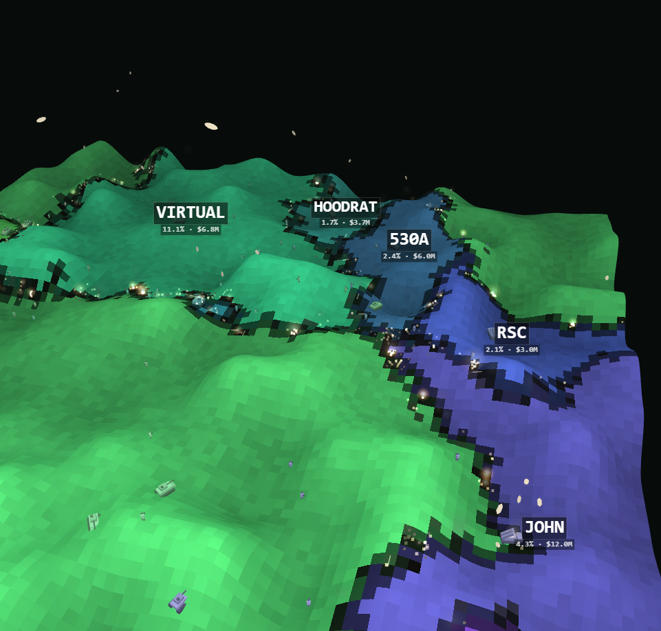

# ⚔️ TOKEN WAR — Robinhood Chain

**Live memecoin warfare.** Every token on Robinhood Chain is an empire on a 3D war map. Territory is earned with real market data — volume, liquidity and market cap — and lost to artillery, F-35 strikes and nuclear missiles triggered by real on-chain trades.



## How it works

- **Territory ∝ War Power** — each empire's land equals its share of `volume^0.45 × liquidity^0.30 × mcap^0.25`. A rugged token starves no matter how much wash volume it prints. Switch the map to raw VOL / MCAP / LIQ any time.
- **Real trades are real attacks** — live swaps from the top pools land as strikes, with the buyer/seller wallet in the killfeed:
  - big **BUY** → ☢ ballistic missile launched from the empire's S-400 capital site, nuclear detonation, mushroom cloud, crater
  - big **SELL** → ✈ F-35 carpet-bombing run across the seller's own land
- **Armies live on the map** — infantry, tanks, fighter patrols and one missile battery per capital; shells arc across the fronts and captures land where they hit.
- **Rug radar** — volume with no liquidity/mcap gets flagged ☠ RUG ALERT and the empire collapses on screen.
- **Copycat purge** — one flag per ticker: only the strongest contract carries the name (toggle CLONES to let the imitators fight too).
- 3D drone camera (drag to pan, wheel to zoom, right-drag to orbit, double-click to fly, WASD) with an auto-cinematic mode that swoops onto nuclear strikes. Classic 2D map included. Fully synthesized war audio — no sound files.

## Data

[GeckoTerminal API](https://www.geckoterminal.com) — top pools on the `robinhood` network, refreshed continuously; trades polled per pool. No keys required.

## Run locally

```bash
node dev-server.js   # http://localhost:5178 — static files + a rate-limit-friendly API proxy
```

Deployed builds (Vercel/Pages/any static host) don't need the server: the client talks to the GeckoTerminal API directly.

## Stack

Zero dependencies. One `index.html` (simulation + 2D renderer + audio), `view3d.js` (three.js scene, models built in code), vendored `three.min.js` (r147, MIT).

---

*Not financial advice. The map shows market data as war — it doesn't tell you what to buy. Inspired by [Bitcoin Battlefield](https://bitcoin-battlefield.pages.dev).*
